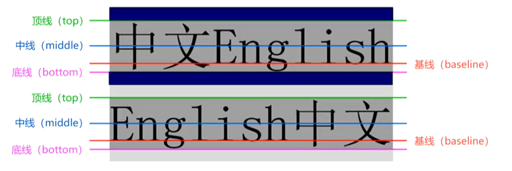
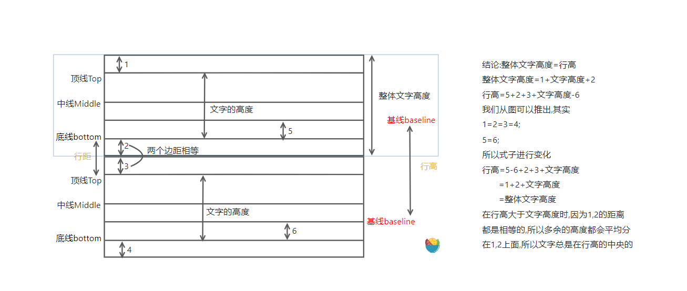
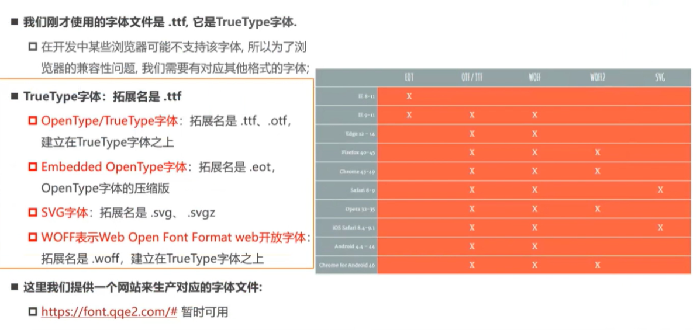

# CSS
## 基础知识
## 颜色的表示
- RGB,16进制
   1. RGB的三个位置的表示刚好对应16进制的每两位
   2. RGB(100,100,100) 等价于 #646464,因为100对应的16进制是64
   3. RGBA(0,0,0,255)和#000000ff,可以看到最后这两位,这两位代表的是alpha透明通道,代表透明度,255和ff都是代表二进制的1,要想增加透明度,那么对应的减少最后两位的值即可,转换规则是255*透明百分比,如果是16进制则需要转换成16进制

## 文本属性
1. text-decoration:
   1. none: 无任何装饰线
   2. underline: 下划线
   3. overline: 上划线
   4. line-through: 删除线

2. text-transform:
   1. capitalize: 单词首字母大写
   2. uppercase: 所有字符大写
   3. lowercase: 所有字符小写
   4. none: 没有影响

3. text-indent: 文字缩进
4. ✨text-align:
   1. left: 左对齐
   2. right: 右对齐
   3. center: 正中间对齐
   4. justify: 两端对齐
   5. 这个属性专门是针对==行内级元素==来进行对齐的

5. letter-spacing:字母之间的间距
6. word-spacing:单词之间的间距

## 字体属性
1. ✨font-size:
   - 字体单位
      1. px:固定css像素单位
      2. em:相对于父元素的字体大小,1em等价于父元素的字体大小
      3. 百分比:因为每个元素设置百分比相对于什么作比较是不固定的,如果要用百分比需要去MDN文档中查询,对应的百分比是相对于那个设置的

2. ✨font-family:设置文本字体
   - 可以设置多个字体
   - 浏览器会选择列表中第一个计算机已经安装的字体
   - 可以通过`@font-face`下载网络字体

3. ✨font-weight:设置文本粗细
   - normal:400
   - bold:700

4. font-style:设置文本的常规,斜体显示
   - normal:常规显示
   - italic(斜体):字体的斜体显示(通常会有专门字体)
   - oblique(斜体):文本倾斜显示(仅仅让文字倾斜)

5. font-variant(了解,基本不用):影响小字母的显示方式
   - normal
   - small-caps:将小写字母替换为缩小过的大写字母

6. line-height:一行文本所占据的高度
   1. 严格定义:两行文字基线(baseline)之间的间距
   
   

7. font:所有有关字体属性的缩写,是font-style,font-variant,font-weight,`font-size/line-height`和font-family属性的简写
   1. font-style,font-variant,font-weight可以随意调换顺序,也可以省略
   2. /line-height可以省略,如果不省略,必须放在font-size后面
   3. font-size,font-family不可以调换顺序,不可以省略

## CSS选择器
   1. 通用选择器
   2. 元素选择器
   3. 类选择器
   4. id选择器
   5. 属性选择器
   6. 后代选择器
   7. 直接子代选择器:`>`自己的第一层子代
   8. 相邻兄弟选择器:`+`只选出靠近自己的第一个兄弟
   9. 普遍兄弟选择器:`~`选出所有相邻的兄弟
   10. 交集选择器:`div.box`用于精准选中某一个元素
   11. 并集选择器:`,`
   12. 伪类
       1. 动态伪类(dynamic pseudo-classes)
       2. 目标伪类(target ~)
       3. 语言伪类(language ~)
       4. 元素状态伪类(UI element states ~)
       5. 结构伪类(structure ~)
       6. 否定伪类(negation)
       7. 伪类的注意事项:
          1. `:link,:visited,:hover.:active`,这四个顺序不能乱,一定要按照这个顺序来,简写:`LVHA`
   13. 伪元素:推荐使用两个冒号,伪类使用一个冒号
       1.  `::first-line/::first-letter`
       2.  `::before/::after`:注意其中的content不能被省略,即使是不想要内容,也需要保留.如果想要引入资源的时候,使用`url()`,动态的引入资源

## CSS选择器-结构伪类
:nth-child
1. 用于选中当前元素的第几个,但是会受其他元素干扰,如果选中的元素的哪一个层级中有其他元素,也会计算进去
2. 2n: 选偶数 2n+1选奇数

:nth-last-child
1. 用法和nth:child一样,这个是从后往前选

:nth-of-type
1. 这个是选中所属元素的第几个,不受其他元素的影响

:root: 修改html元素
:empty: 修改内容为空的元素

```CSS
/* 直接就会选中第三个div 这是与nth-child的区别 */
div:nth-child(3){
   /* 选中的是p */
}
div:nth-of-type(3){
   /*选中的是 div*/
}
```
```HTML
 <div></div>
 <div></div>
 <p></p>
 <div></div>
 <div></div>
```

## CSS的继承
### CSS的属性继承
1. 常见的属性继承
   - font-size
   - font-family
   - font-weight
   - line-height
   - color
   - text-align

2. 强制性继承,在子代元素设置`inherit`,能强制继承那些原先不能被继承的元素
3. 继承过来的值是计算值而不是设置值,是已经计算好的值,而不是那些相对单位的值,例如父级是2em,那么子级继承则是32px,并不是2em

### CSS属性的层叠
如何判断CSS属性的层叠
1. 选择器的权重,权重大的生效,根据权重判断优先级
2. 先后顺序,权重相同时,后面设置的生效
3. 权重顺序
   1. `!important`:10000
   2. 内联样式:1000
   3. id选择器:100
   4. 类选择器,属性选择器,伪类:10
   5. 元素选择器,伪元素:1
   6. 通配符:0

## CSS属性:display
1. block:块级元素
2. inline:行内元素,行内元素设置宽高不生效,但是对于`img`元素是不生效的,虽然img是行内元素,但是它同时也是一个可替换元素.
3. inline-block:行内块元素
4. none:隐藏元素

---
编写HTML的注意事项
- 块级元素,inline-block元素
  - 一般情况下,可以包含其他任何元素(比如块级元素,行内级元素,inline-block元素)
  - 特殊情况下,p元素不能包含其他块级元素
- 行内级元素(a,spacing,strong)
  - 一般情况下,只包含行内级元素

## CSS的隐藏方法

1. `display:none`:直接消失,不占有位置
2. `visibility: hidden | visible`:只是界面上隐藏,仍旧占据位置
3. `rgba`:设置颜色的透明度,为0时,元素会看不见,但仍旧占据位置
4. `opacity`:设置元素的透明度.但同时会设置所有的子元素也会有透明度.

## CSS属性:overflow
1. hidden:会将多余的元素隐藏
2. auto:会根据内容自己判断
3. scroll:会一直拥有滚动条
4. visible:即使溢出,仍旧会展示

## CSS的样式不生效的技巧
1. 选择器的优先级太低
2. 选择器没选中对应的元素
3. CSS属性的使用形式不对
   1. 元素不支持此CSS属性
   2. 浏览器不支持此CSS属性
   3. 被同类型的CSS属性覆盖

## CSS的盒子模型
盒子模型由以下东西组成
1. 内容(content)
2. 内边距(padding)
3. 边框(border)
4. 外边距(margin)

---
- ==注意==:width和height的默认值是`auto`
- max-width和min-width:代表最大宽度和最小宽度
- min-height和max-height: 这两个不常用
- padding: 如果是三个值的话,left没写的话,会使用right的值

---
border
1. border-width
2. border-style
3. border-color
4. border-radius: 百分比超过50%,效果是一样的,都是一个⚪

---
margin
1. 上下margin的传递
   1. margin-top的传递
      - 如果块级元素的顶部线和父元素的顶部线重叠,那么这个块级元素的margin-top值会传递给父元素
   2. margin-bottom传递
   - 如果块级元素的底部线和父元素的底部线重写,并且父元素的高度是`auto`,那么这个块级元素的margin-bottom值会传递给父元素

2. margin传递解决方案
   1. BFC:在父元素设置`overflow:auto`,还有其他的方案可以触发
   2. 给父元素设置border

3. 建议
   1. margin一般是用来设置兄弟之间的间距
   2. padding一般是用来设置父子之间的间距

4. 上下margin的折叠: 垂直方向上相邻的2个margin(margin-top,margin-bottom)有可能合并为1个margin,这种现象叫做collapse(折叠)
   1. 折叠计算规则:两个值进行比较,取较大的值
   2. 只设置其中一个元素的margin

5. 块级元素居中的方法: `margin:0 auto`的原理
   1. 首先我们要了解`块级元素=width+padding+margin+border`
   2. 当一个块级元素设置为具体宽度时,其他未设置时,此时padding,border都是0,此时margin-left和margin-right都是0
   3. 但是w3c规定一个块级元素,必须要占满整行,那么浏览器就会自动给margin-right进行分配这一行剩余的宽度
   4. 但是当我们设置`margin:0 auto`的时候,这时候就是相当于告诉浏览器,我将`margin-left`和`margin-right`设置为auto了,你这个时候需要将剩余的宽度平均分到left和right上去了,所以说这个时候margin就会帮忙将块级元素进行一个居中显示了

## CSS的属性: outline(外边距)
1. 不会占据实际空间
2. 实际使用场景: a连接的使用Tab栏选中的时候,不需要那个外边框
3. a元素直接使用outline也是可以消除掉的,因为直接设置属性,也是相当于给所有的伪类设置了属性,是一起设置的
4. input的默认outline去除

## CSS属性: box-shadow
1. 属性值: x偏移量 y偏移量 blur 向外扩散 color 阴影位置

## CSS属性: text-shadow
1. 用法上和box-shadow是一样的,就是没有向外扩散

## 行内非替换元素的注意事项
1. 对于像`span`这种元素来讲,设置padding,border,虽然看起来盒子内容撑大了,但是实际上并不占据位置
2. margin只能设置左右,上下不会设置

## CSS多行省略
```CSS
overflow:hidden;
text-overflow:ellipsis;
display:-webkit-box;
-webkit-line-clamp:3;
-webkit-box-orient:vertical;
```

## CSS属性: 设置背景
1. background-image
2. background-repeat
3. background-size
4. background-position
5. background-attachment

## web字体
使用流程
1. 需要有对应的font字体，放到对应的目录下
2. 使用@font-face,设置具体的字体
```CSS
   @font-face{
      font-family:"你自己随便起个名字";
      src:url("字体存放的位置")
   }
```
3. 使用的时候,font-family使用我们自己定义的字体即可

web字体的兼容性


## 精灵图
好处
1. 减少网页的http请求次数,加快网页相应速度,减轻服务器压力
2. 减小图片总大小
3. 解决了图片命名的困扰,只需要针对一张集合的图片命名
4. [精灵图工具网址](http://www.spritecow.com/)  

## CSS定位
1. 标准流布局
   1. 从左至右,从上至下的布局排列,互相不会重叠,这是浏览器的默认布局
   2. 通过 margin,padding 进行调整

----
`left,top,bottom,right`是在设置了定位之后才会生效,设置static无效,因为这是标准流
2. 相对定位(relative):相对于自己的原来的位置进行调整
3. 固定定位: 相对于浏览器的可视窗口来进行定位的
4. 绝对定位:相对于离自己最近的一个定位元素,如果都没有,则是相对于视口定位
5. 粘性定位:相对于最近的滚动祖先包含滚动视口的进行一个定位  
6. z-index: 仅对==定位元素==生效,只是针对==同层级==的元素,进行一个层级比较
7. 当我们将定位设置成absolute/fixed时,这个时候不管元素是什么级别
   1. 都可以设置宽高
   2. 宽高默认由内容决定
   3. 不再受标准流的约束
   4. 不再严格按照从上到下,从左到右排布
   5. 不再严格区分块级(block),行内级(inline),行内块级(inline-block)的很多特性都会消失
   6. 不再给父元素汇报宽高数据
8. 对于绝对定位元素来讲
   1. 定位参考对象的宽度=`left`+`right`+`margin-left`+`margin-right`+绝对定位元素的实际占用宽度.
   2. 定位参考对象的高度=`top`+`bottom`+`margin-top`+`margin-bottom`+绝对元素的实际占用高度
   3. 如果想要绝对定位元素获得与参照对象相同的高度和宽度,需要设置`margin:0; left:0;right:0;top:0;bottom:0;`
   4. 如果想要居中显示的话,那么给定绝对定位元素宽高后,设置`margin:auto;left:0;right:0;top:0;bottom:0`即可
   5. 前面二者的原理参考那个公式即可明白

## CSS的浮动(float)
最初的设计目的
1. float属性可以指定一个元素应沿其容器的**左侧**或**右侧**放置,允许**文本和内联元素**环绕它.
2. 最早是用于在一段文本内浮动图像,实现文字环绕的效果
3. 但是因为早期的CSS标准中没有提供好的左右布局方案,在一段时间内他成为网页多列布局的最常用工具

浮动规则
1. 浮动只会在父级元素内进行浮动
2. 浮动元素最多只能浮动到padding前,如果有padding,那么则是紧贴padding
3. 浮动元素之间不会层叠
4. 浮动元素不能与行内级内容层叠

浮动问题-高度塌陷
1. 父元素计算总高度时,就不会计算浮动子元素的高度,导致了高度塌陷的问题
2. 解决方案:
   1. clear属性可以指定一个元素是否必须移动(清除浮动后)到在他之前的浮动元素下面
      1. left:元素低于之前的左浮动元素的底部
      2. right:右浮动元素的底部
      3. both:所有浮动元素的底部
      4. none:默认值,无特殊要求
   2. 清除浮动的样式代码
   ```CSS
      .clear-fix::after{
         content:"";
         clear:both;
         display:block;

         visibility:hidden /*浏览器兼容性*/
         height:0; /*浏览器兼容性*/
      }

      .clear-fix{
         *zoom:1; /*浏览器兼容性*/
      }
   ```
   3. 稍微解释一下这个代码
      1. 首先,我们要了解clear这个属性是给元素加上之后,会被添加到浮元素的下面,而不会造成一个高度塌陷的问题.
      2. 其次,我们使用伪元素在浮动元素的包裹盒子的后面加上,这样子一个块级元素直接被加在了浮动元素的后面,这样子继续保持了文档的标准,后面的内容就会挤着那个伪元素往下走.

## CSS-flex布局
### flex布局的重要概念
1. 开启了flex布局的元素叫 **flex container**
2. flex container 里面的**直接子元素**叫做 **flex item**
3. flex item的布局将受flex container属性的设置来进行控制和布局
4. flex item不再严格区分块级元素和行内级元素
5. flex item默认情况下是包裹内容的,但是可以设置宽度和高度
6. 当设置display属性为flex时或者inline-flex可以成为flex container
   1. flex: flex container 以block-level形式存在
   2. inline-flex: flex container 以inline-level形式存在
7. flex container中是按照主轴来进行排列的,同时有主轴的同时,有一个交叉轴
8. 可以用在flex container和flex item上的属性
   1. flex container
      1. flex-flow
      2. flex-direction
      3. flex-wrap
      4. justify-content
      5. align-items
      6. align-content
   2. flex items
      1. flex-grow
      2. flex-basis
      3. flex-shrink
      4. order: 用于item排序的
      5. align-self
      6. flex:简写属性
         1. `none | [<"flex-grow"> <"flex-shrink">? || <"flex-basis">]`
         2. flex属性可以指定一个,两个或三个值

## CSS属性：transform
1. 介绍: 该属性允许对其中一个元素进行某些形变，包括**旋转，缩放，倾斜或平移**等
2. 行内级元素和表格元素不能进行形变

### 常见的函数 平移，缩放，旋转，倾斜(skew)
1. translate: 在方向上做一个平移
   1. 当只有一个值的时候,是只设置了x轴的方向,设置两个值才是x,y方向的
   2. 如果单位是百分比的话,是相对于自己的

2. scale: 缩放
   1. 当只有一个值的时候,是只设置了x轴的方向,设置两个值才是x,y方向的
   2. 如果单位是百分比的话,是相对于自己的

3. rotate: 旋转
   1. 正的是顺时针,负的是逆时针

4. transform-origin: 默认值是center center

## CSS transition
1. 它可以决定
   1. 哪些属性可以发生动画效果(明确列出这些属性)
   2. 何时开始(delay)
   3. 持续开始(duration)
   4. 如何动画(timing function)
 